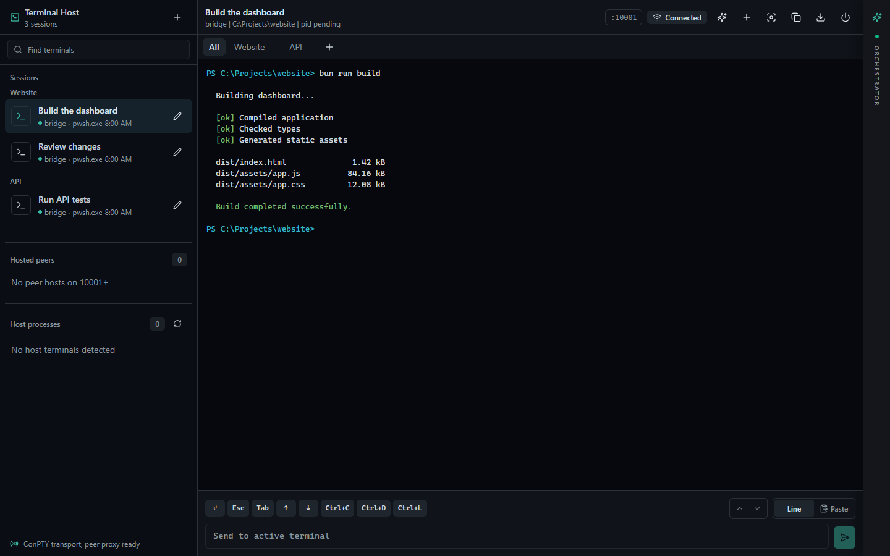
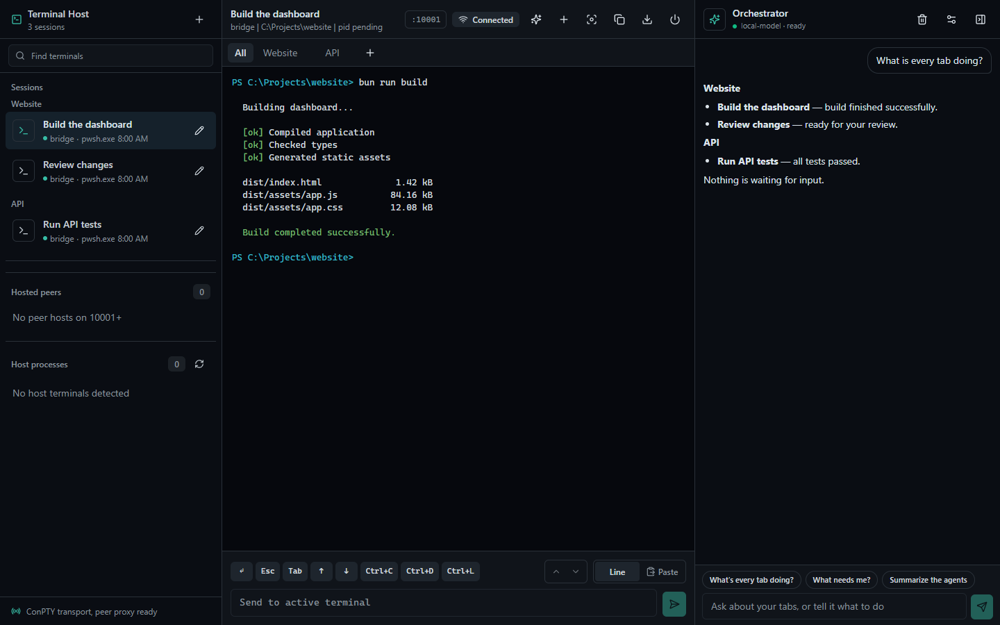

# JustTerminal

A Windows Terminal fork for working across projects, AI agents, and your phone.

**[Download for Windows (x64)](https://github.com/JustSuperHuman/terminal/releases/latest)**

Extract the ZIP into a writable folder and run **WindowsTerminal.exe**. Requires Windows 10 (build 19041) or later. No installer, Bun, or Node.js is needed to run the desktop app.

## Features

- **Project tabs:** keep terminals grouped by working directory in the desktop sidebar.
- **Shared sessions:** open the built-in web client or connect the mobile companion to your desktop terminals.
- **One orchestrator:** ask about your tabs and coordinate work from a shared chat on desktop, web, and mobile. Configure your model provider in the orchestrator settings.
- **Mobile controls:** stable project groups, automatic reconnection, separate Send and Enter actions, Alt+↑, and a keyboard toggle. New sessions start in the last selected session's directory.

## Screenshots

The web client, rendered with demo sessions:



The shared orchestrator beside an active terminal (demo conversation):



## Connect your phone

Keep JustTerminal running on your PC. Open its web host at `http://localhost:10001` (the host chooses another port if that one is occupied). Use the PC's reachable network address and access token to connect from your phone.

The [mobile companion](tools/just-terminal) is an Expo app built separately; the Windows ZIP does not contain an Android or iOS installer. See the [mobile guide](tools/just-terminal/README.md) for development setup.

Terminal settings stay beside the portable app. Bridge and orchestrator data are stored in `%LOCALAPPDATA%\TerminalWeb`.

## Build and package

On Windows, install Visual Studio with the C++ desktop/UWP tools, a Windows SDK, PowerShell 7, Rust (MSVC toolchain), and Bun. See the [build prerequisites](doc/building.md) for the native toolchain details.

```powershell
git clone --recursive https://github.com/JustSuperHuman/terminal.git
cd terminal
bun run package
```

This builds the web client and native Release app, then writes a portable ZIP and `SHA256SUMS.txt` to `artifacts/releases/`.

```powershell
bun run package -Platform arm64   # Requires the matching C++ and Rust targets
bun run package -SkipBuild        # Repackage an existing Release build
```

For local development, use `bun run build` and `bun run launch`. Screenshots can be regenerated with `node scripts/capture-readme.mjs` from `tools/terminal-web` after building its client.

## Credits

An independent fork of [Microsoft Windows Terminal](https://github.com/microsoft/terminal), licensed under [MIT](LICENSE). See [NOTICE.md](NOTICE.md) for third-party notices and the [upstream README](https://github.com/microsoft/terminal#readme) for the original project documentation.

